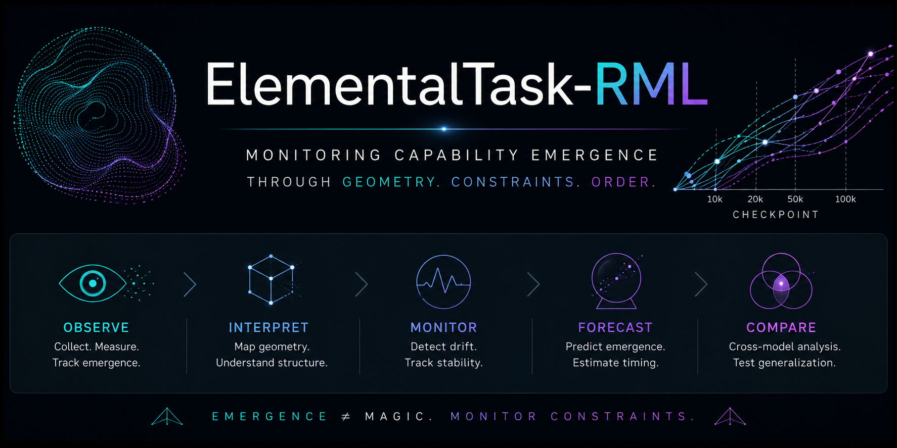

<p align="center">
  
</p>

# ElementalTask-RML

<a href="paper.pdf">ElementalTask-RML: Emergence-Order Monitoring Extensions for
ElementalTask</a>

observe → interpret → monitor → forecast → compare

This fork extends ElementalTask with Residue Manifold Learning (RML) and CGCS-inspired emergence monitoring.

## Goals

- monitor emergence ordering across checkpoints,
- analyze function-vector trajectory stability,
- detect constraint-score drift,
- forecast composite capability emergence,
- compare emergence ordering across model families.

Emergence ≠ magic. Monitor constraints. 📐

---

## Notebook Progression

| Notebook | Focus |
|---|---|
| 01 | [emergence-order monitoring](./01_emergence_order_monitor.ipynb) |
| 02 | [function-vector drift monitoring](./02_function_vector_geometry.ipynb) |
| 03 | [ahead/behind schedule constraint detection](./03_constraint_drift_detection.ipynb) |
| 04 | [early emergence forecasting](./04_emergence_forecasting.ipynb) |
| 05 | [cross-model stability + transfer](./05_cross_model_stability.ipynb) |

---

## Core Monitoring Stack

ElementalTask-RML explores whether capability emergence behaves as a stable geometric ordering process across checkpoints and model families.

Current monitoring layers include:

- emergence rank correlation,
- function-vector geometry,
- drift recovery trajectories,
- composite-task emergence constraints,
- cross-model transfer stability,
- CGCS-inspired constraint scoring.

---

## Repo Structure

```text
notebooks_rml/
├── 01_emergence_order_monitor.ipynb
├── 02_function_vector_geometry.ipynb
├── 03_constraint_drift_detection.ipynb
├── 04_emergence_forecasting.ipynb
├── 05_cross_model_stability.ipynb
├── figures/
├── results/
└── README.md
```

---

## Related Work

- [Residue Manifold Learning (RML)](https://github.com/thinkthoughts/residue-manifold-learning)

---

## Roadmap

Next steps:

- real upstream FV extraction integration,
- checkpoint trajectory adapters,
- forecast confidence calibration,
- mod30/RML geometry experiments,
- multi-model emergence comparison benchmarks,
- lightweight paper/report generation pipeline.

---

Built on top of:

- ElementalTask
- function-vector analysis
- emergence trajectory monitoring
- RML / CGCS constraint geometry
